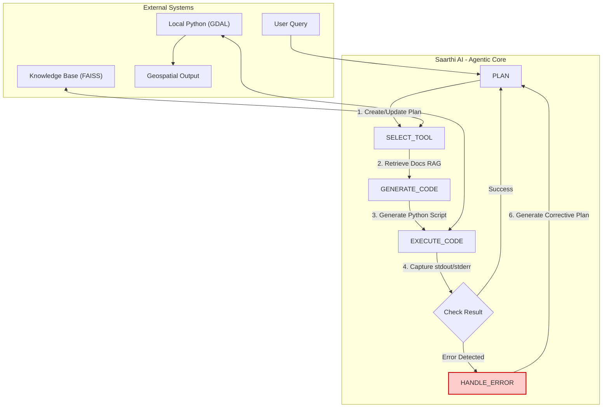

<div align="center">

# 🛰️ Saarthi AI: Your Digital Charioteer for Geospatial Intelligence

**A project for the Bharatiya Antariksh Hackathon 2025**

</div>

<div align="center">

*Saarthi AI is an advanced reasoning engine that transforms natural language commands into complex, multi-step geospatial analysis workflows. It acts as a digital expert, orchestrating a suite of powerful GIS tools to deliver insights, not just data.*

</div>

<p align="center">
  
  
  
</p>

---

## 🚀 The Mission: Bridging Human Intent and Machine Execution

Geospatial analysis is powerful, but it's also a bottleneck. A simple question like *"Show me areas in Gujarat vulnerable to flooding"* can trigger hours of work for a human expert involving data sourcing, tool selection, complex processing, and error handling.

**Saarthi AI** was born to solve this. It's not just a tool; it's an intelligent partner. Named after the Sanskrit word for "charioteer" (सारथि), Saarthi doesn't just execute commands—it understands the goal, plans the journey, and expertly guides the tools (the "horses") to the destination, navigating obstacles along the way.

## ✨ Core Features

Saarthi is built on a foundation of cutting-edge AI techniques to emulate the workflow of a seasoned GIS analyst.

* **🧠 Natural Language Reasoning:** Ask complex questions in plain English. Saarthi decomposes your high-level goal into a logical sequence of actions.
* **📝 Transparent Chain-of-Thought (CoT) Planning:** Watch Saarthi "think" in real-time. The UI displays its step-by-step plan, providing complete transparency into its reasoning process.
* **🛠️ RAG-Powered Tool Mastery:** Saarthi uses Retrieval-Augmented Generation (RAG) to consult a knowledge base of GIS tool documentation (GDAL), ensuring it generates accurate, executable code every time.
* **🔄 Robust Self-Correction Loop:** This is Saarthi's superpower. When real-world data issues cause an error (like a CRS mismatch), Saarthi doesn't crash. It analyzes the error, formulates a new plan to fix it (e.g., "I will reproject the layer"), and re-attempts the task.
* **🌐 Multi-Source Data Integration:** Seamlessly orchestrates data access from sources like ISRO's Bhuvanidhi portal and OpenStreetMap.

## 🏛️ Architecture: The Robust Orchestrator

Saarthi is implemented as a stateful, cyclical graph using LangGraph. This architecture treats failure not as an endpoint, but as a state, enabling true resilience.



## 💻 Tech Stack

| Category          | Technology                                       |
| ----------------- | ------------------------------------------------ |
| **Orchestration** | LangGraph, LangChain                             |
| **LLM Provider** | Groq (Llama 3)                                   |
| **Knowledge Base**| FAISS, Sentence-Transformers                     |
| **Geospatial** | GDAL, Python 3                                   |
| **Backend** | FastAPI, Uvicorn                                 |
| **Frontend** | HTML, CSS, JavaScript (with Leaflet.js for maps) |

## ⚙️ Getting Started: Running Saarthi Locally

This setup uses a local Python virtual environment.

**Prerequisites:**
* Python 3.11+
* Git
* **GDAL installed on your system.** (This is crucial. The easiest way on Windows is via the [OSGeo4W installer](https://www.osgeo.org/projects/osgeo4w/)).

**1. Clone the Repository:**
```bash
git clone [https://github.com/NandiniBytes/saarthi-ai.git](https://github.com/NandiniBytes/saarthi-ai.git)
cd saarthi-ai
```

**2. Set Up the Backend Environment:**
Navigate to the backend directory:
```bash
cd saarthi-backend
```
Create and activate a Python virtual environment:
```bash
# For Windows
python -m venv venv
.\venv\Scripts\activate

# For macOS/Linux
python3 -m venv venv
source venv/bin/activate
```

**3. Install Dependencies:**
```bash
pip install -r requirements.txt
```

**4. Create your Environment File:**
Create a file named `.env` inside the `saarthi-backend` directory and add your Groq API key:
```
GROQ_API_KEY="your-groq-api-key-here"
```

**5. Build the Knowledge Base:**
The agent needs a vector store of tool documentation. Run the build script once:
```bash
python knowledge_base/build_kb.py
```

**6. Run the Backend Server:**
```bash
uvicorn main:app --reload
```
The backend will now be running at `http://127.0.0.1:8000`.

**7. Connect via ngrok (Optional for live testing):**
To connect your deployed frontend to your local backend, open a new terminal and run:
```bash
ngrok http 8000
```
Use the generated forwarding URL in your frontend's API calls.

## 🔭 Future Roadmap

The Robust Orchestrator is a powerful foundation. Future versions of Saarthi will explore even more advanced agentic architectures:

* **Hierarchical Multi-Agent System:** A "team" of specialized agents (e.g., a DataScout, a GIS-Processor) managed by a central orchestrator.
* **Proactive MCTS Planner:** Using Monte Carlo Tree Search to explore multiple solution paths and proactively choose the most efficient one.
* **Self-Improving Agent:** An agent that learns from its successes, adding completed workflows back into its knowledge base to solve similar problems faster in the future.

---

<div align="center">

**Built with ❤️ for the future of space technology in India.**

</div>
